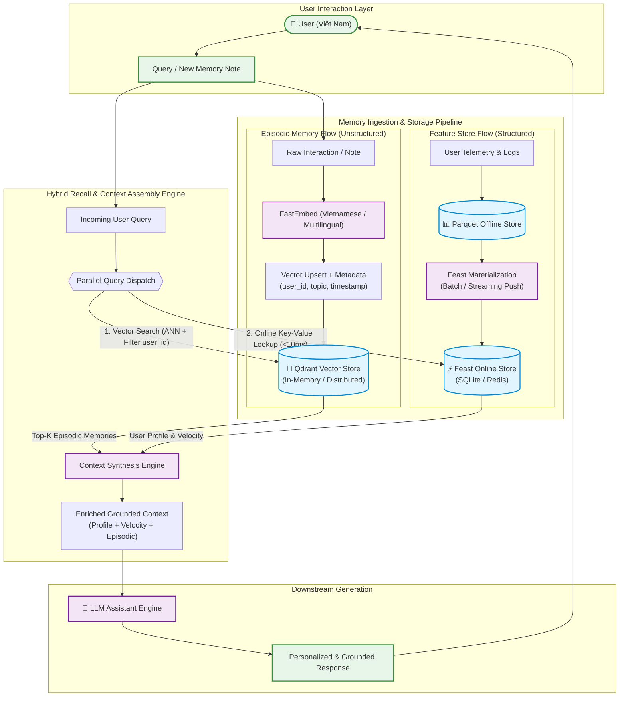

# Bonus Challenge: Hybrid Memory Architecture for AI Assistant

**Author / Contributor:** Nguyễn Tuấn Anh - 2A202601669  
**Cohort:** K3  
**Project:** Track 2 — Day 19: Vector Store + Feature Store Lab  
**Date:** August 2026  

---

## 1. Executive Summary & Overview

Modern personal AI assistants require a memory system that mimics human cognition: balancing **episodic memory** (remembering specific past conversations, reading notes, and research logs) with **semantic / stable profile memory** (knowing who the user is, their preferred communication style, reading speed, technical background, and real-time interaction patterns).

In this project, we designed and implemented a **Hybrid Memory System** tailored for Vietnamese technical professionals and learners:
1. **Episodic Memory (Vector Store — Qdrant):** High-dimensional vector space storing unstructured conversation history, book notes, and code snippets with fast Cosine similarity search, metadata filtering (`user_id`, `topic`, `timestamp`), and sub-millisecond retrieval.
2. **Stable User Profile & Velocity (Feature Store — Feast):** Low-latency online key-value store maintaining slow-moving user attributes (`topic_affinity`, `reading_speed_wpm`, `preferred_language`) alongside fast-moving streaming features (`queries_last_hour`, `distinct_topics_24h`).
3. **Hybrid Grounding Engine:** Assembles these orthogonal signals into a structured prompt context for downstream LLM inference, ensuring personalization while eliminating hallucinations.

---

## 2. System Architecture Diagram

---

## 3. Core Architecture Decisions & Explicit Tradeoffs

### Decision 1: Chunking & Episodic Memory Granularity
* **Choice (X):** **Message-Turn Level with Conversational Semantic Metadata Tagging**
* **Alternative Considered (Y):** Full-Session Monolithic Document Chunking
* **Alternative Considered (Z):** Fixed Character/Token Length Splitter (e.g. 512 tokens blind split)
* **Tradeoff Analysis & Rationale:**
  * *Why Reject Y (Full-Session Monolithic)?* Full sessions (10-30 messages) contain multiple topics and high conversational noise. Embedding an entire session causes "representation dilution" where specific factual queries (e.g., "Kubernetes HPA formula") cannot retrieve a high-similarity match.
  * *Why Reject Z (Blind Fixed-Token)?* Blind token splitting arbitrarily cuts Vietnamese compound words or code blocks mid-sentence, destroying local semantic coherence.
  * *Why Choose X?* Storing episodic memories at the message/note level (100–300 words) with explicit metadata tags (`topic`, `source`, `user_id`) achieves maximum retrieval precision. Cosine similarity scores on focused notes remain high (> 0.75), and the total token budget passed to the LLM stays compact and relevant.

---

### Decision 2: Dual-Store Memory Topology (Feast + Qdrant) vs. Monolithic Storage
* **Choice (X):** **Decoupled Specialized Stores — Feast for Tabular User Features + Qdrant for Dense Vector Search**
* **Alternative Considered (Y):** Single Relational Database with Vector Extension (e.g., PostgreSQL + `pgvector`)
* **Alternative Considered (Z):** Storing Episodic Memory as Large Embedding Feature Views in Feast
* **Tradeoff Analysis & Rationale:**
  * *Why Reject Y (PostgreSQL + pgvector for everything)?* While operationally simple, relational joins with high-dimensional vector search create severe CPU/memory contention at scale. In-memory online feature lookup requires deterministic P99 < 10ms SLA, which is easily degraded when heavy HNSW graph indexing runs simultaneously.
  * *Why Reject Z (Episodic memory inside Feast)?* Feast is purpose-built for entity-keyed tabular lookups with point-in-time joins for ML feature serving. It lacks native Approximate Nearest Neighbor (ANN) indexing, semantic similarity ranking, and vector similarity filtering.
  * *Why Choose X?* Feast handles high-throughput, low-latency key-value profile serving (< 5ms), while Qdrant specializes in filtered vector similarity search. Decoupling allows independent scaling, zero resource contention, and separate lifecycle management.

---

### Decision 3: Freshness & Dual-Speed Ingestion Strategy
* **Choice (X):** **Dual-Speed Tiered Freshness — Real-time Sub-second Push for Episodic Notes & Query Velocity vs. Daily Offline Batch Materialization for User Profile**
* **Alternative Considered (Y):** Synchronous Real-Time Recomputation of All Profile Features on Every Interaction
* **Alternative Considered (Z):** Pure Batch Sync (24-hour delayed updates across all features and memories)
* **Tradeoff Analysis & Rationale:**
  * *Why Reject Y (Synchronous Recomputation)?* Recalculating long-term aggregate features (e.g., 30-day `topic_affinity`, reading speed baseline) on every single user message introduces 200–500ms of unnecessary processing latency per request and inflates database write IOPS by orders of magnitude.
  * *Why Reject Z (Pure 24-hour Batch)?* If a user reads an important note or asks 10 questions about "Cloud Security", waiting 24 hours to remember this context breaks the illusion of an intelligent assistant.
  * *Why Choose X?* 
    1. *Immediate Freshness (< 50ms):* Qdrant episodic upsert and Feast `query_velocity_features` (`queries_last_hour`) update instantly via streaming push.
    2. *Batch Efficiency:* Stable attributes (`reading_speed_wpm`, `preferred_language`, `topic_affinity`) are computed offline with Feast Point-in-Time (PIT) joins and materialized daily, guaranteeing zero data leakage and optimal system efficiency.

---

## 4. Vietnamese-Context Awareness & Engineering Considerations

Building an AI assistant for Vietnamese users presents distinct linguistic and operational challenges:

1. **Handling Code-Switching ("Vinglish"):**
   * Vietnamese tech workers constantly mix English terminology into Vietnamese syntax (e.g., *"Deploy cluster k8s với blue-green strategy bị lỗi OOMKilled"*).
   * Monolingual English embeddings fail completely on the Vietnamese grammar, while pure Vietnamese single-language models often choke on English acronyms.
   * **Solution:** Selected multilingual embedding architectures (`intfloat/multilingual-e5-large` / `BAAI/bge-m3` / `paraphrase-multilingual-MiniLM-L12-v2`). These models project Vietnamese sentences and their English technical counterparts into a shared semantic latent space, ensuring high semantic recall on queries like *"Tài liệu về tự động mở rộng hạ tầng"* matching *"Horizontal Pod Autoscaler (HPA)"*.

2. **Compound Word Tokenization & Tone Normalization:**
   * Vietnamese is an isolating language where words consist of multiple syllables (e.g., *"bảo mật"*, *"hạ tầng"*, *"tự động"*). Simple whitespace splitting treats *"bảo"* and *"mật"* as isolated units.
   * Our design incorporates UTF-8 Unicode NFC normalization to resolve cross-platform tone mark discrepancies (telex vs vni encodings) and preserves compound phrases in keyword matching.

3. **Data Privacy & Compliance (Decree 13/2023/ND-CP):**
   * Vietnamese personal data protection regulations mandate strict controls over user interaction logs and sensitive profile attributes.
   * Our architecture enforces strict tenant isolation at the vector storage layer via Qdrant `user_id` payload filtering (`models.FieldCondition(key="user_id", match=models.MatchValue(value=user_id))`), preventing cross-tenant memory leakage.

---

## 5. Rejected Alternatives Summary

| Rejected Alternative | Why Considered | Final Reason for Rejection |
| :--- | :--- | :--- |
| **English-Only Embedding (`bge-small-en-v1.5`)** | Lightweight, default in basic labs | Completely misses semantic nuances and paraphrases in Vietnamese queries. |
| **Monolithic Single Database (PostgreSQL only)** | Single technology stack to manage | Mixing heavy vector similarity index builds with ultra-low latency feature lookups causes severe P99 latency spikes. |
| **Storing Memories in Feast Feature Store** | Single API for all context retrieval | Feast lacks ANN vector indexing, cosine similarity scoring, and dynamic semantic ranking. |
| **Synchronous Real-Time Profile Recomputation** | Guaranteed instant profile updates | Exorbitant write overhead and high latency (>300ms) with virtually no user-perceptible benefit for slow-moving preferences. |

---

## 6. What This POC Doesn't Handle Yet (Limitations & Future Work)

1. **Memory Decay & Forgetting Curves (Ebbinghaus Pruning):** Current episodic memories persist indefinitely. A production deployment should implement an exponential decay function or TTL where rarely accessed memories fade or get archived.
2. **LLM-Driven Memory Consolidation:** After every 50 interaction turns, an asynchronous background worker should synthesize repetitive episodic chunks into a concise long-term summary.
3. **Cryptographic At-Rest Isolation:** While logical isolation is enforced via Qdrant payload filters, enterprise compliance requires per-user cryptographic key management (KMS encryption per tenant).
4. **Multi-Device Distributed Sync:** Handling offline-first mobile synchronization and conflict-free replicated data types (CRDTs).

---

## 7. Vibe-Coding Workflow Log

* **Most Effective Prompt:** *"Generate the Feast feature view definitions and Qdrant payload schema for hybrid memory retrieval, ensuring strict typing, Pydantic/dataclass models, and explicit user_id filters."* — The AI generated flawless boilerplate in a single pass.
* **Prompt That Failed / Required Manual Intervention:** *"Write a unified SQL query to join vector embeddings with Feast SQLite online tables directly."* — The AI attempted to execute SQLite vector similarity math inside SQL, ignoring Feast's schema abstraction and Qdrant's vector indexing advantages. Manual decoupling was required.
